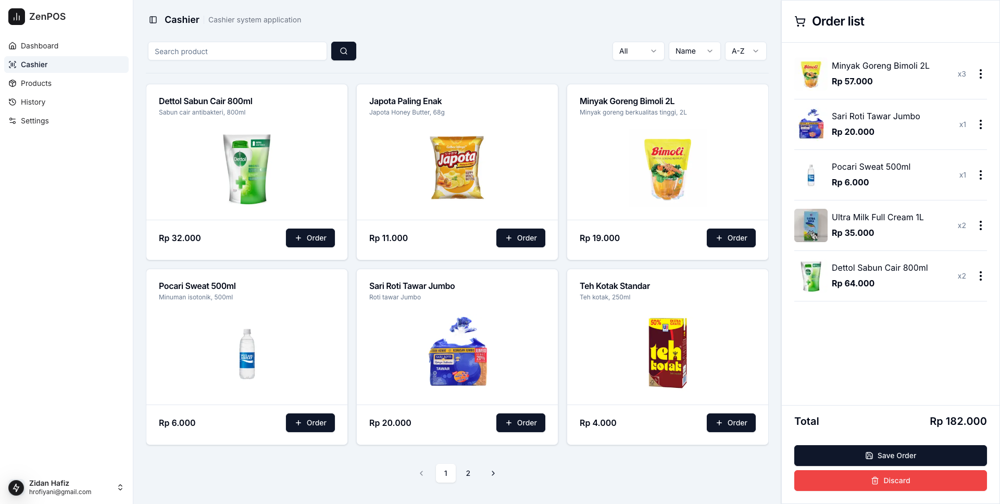

<div align="center">

# ZenPOS - Modern Point of Sale System

[](https://opensource.org/licenses/MIT)
[](https://nextjs.org/)
[](https://supabase.com)
[](https://www.typescriptlang.org/)
[](CONTRIBUTING.md)

A modern, open-source Point of Sale system built with Next.js and Supabase.

[Demo](#demo) •
[Features](#features) •
[Installation](#installation) •
[Documentation](#documentation) •
[Contributing](#contributing) •
[License](#license)

</div>

## 📋 Overview

ZenPOS is a comprehensive Point of Sale solution designed for small to medium-sized businesses. It provides an intuitive interface for managing products, tracking sales, and generating reports. Built with modern web technologies, ZenPOS offers a responsive design that works seamlessly on both desktop and mobile devices.

## ✨ Features

- **User Management** - Secure authentication and role-based access control
- **Product Catalog** - Easy-to-use product management with categories and inventory tracking
- **Transaction Processing** - Smooth and intuitive sales transaction workflow
- **Analytics Dashboard** - Comprehensive sales reports and data visualization
- **Responsive Design** - Works on desktop, tablet, and mobile devices
- **Offline Support** - Continue operations during internet disruptions

## 🖼️ Screenshots

<div align="center">
   
</div>

## 🛠️ Tech Stack

- **Frontend**
  - [Next.js](https://nextjs.org) - React framework
  - [TypeScript](https://www.typescriptlang.org/) - Type safety
  - [Tailwind CSS](https://tailwindcss.com) - Styling
  - [shadcn/ui](https://ui.shadcn.com) - UI components
  - [Recharts](https://recharts.org) - Data visualization

- **Backend**
  - [Supabase](https://supabase.com) - Backend as a Service
  - PostgreSQL - Database
  - Row Level Security - Data protection

## 🚀 Installation

### Prerequisites

- Node.js 18.0 or higher
- npm, yarn, or pnpm
- Supabase account

### Setup

1. **Clone the repository**
   ```bash
   git clone https://github.com/zidanhafiz/zenpos.git
   cd zenpos
   ```

2. **Install dependencies**
   ```bash
   npm install
   # or
   yarn install
   # or
   pnpm install
   ```

3. **Set up environment variables**
   ```bash
   cp .env.example .env.local
   ```
   Edit `.env.local` with your Supabase project details.

4. **Set up the database**
   ```bash
   npm run setup-db
   # or
   yarn setup-db
   # or
   pnpm setup-db
   ```
   See [Database Setup](docs/DATABASE_SETUP.md) for detailed instructions.

5. **Start the development server**
   ```bash
   npm run dev
   # or
   yarn dev
   # or
   pnpm dev
   ```

6. **Open [http://localhost:3000](http://localhost:3000)** in your browser.

## 📖 Documentation

- [Database Setup Guide](docs/DATABASE_SETUP.md)
- [API Documentation](docs/API.md) (coming soon)
- [User Guide](docs/USER_GUIDE.md) (coming soon)
- [Deployment Guide](docs/DEPLOYMENT.md) (coming soon)

## 🤝 Contributing

Contributions are welcome and appreciated! Here's how you can contribute:

1. **Fork the repository**
2. **Create a feature branch**
   ```bash
   git checkout -b feature/amazing-feature
   ```
3. **Commit your changes**
   ```bash
   git commit -m 'Add some amazing feature'
   ```
4. **Push to the branch**
   ```bash
   git push origin feature/amazing-feature
   ```
5. **Open a Pull Request**

Please read our [Contributing Guidelines](CONTRIBUTING.md) (coming soon) for details.

## 📄 License

This project is licensed under the MIT License - see the [LICENSE](LICENSE) file for details.

## 💬 Support

If you encounter any issues or have questions:

- [Open an Issue](https://github.com/zidanhafiz/zenpos/issues/new)
- [Start a Discussion](https://github.com/zidanhafiz/zenpos/discussions)

## 🔗 Links

- [Next.js Documentation](https://nextjs.org/docs)
- [Supabase Documentation](https://supabase.com/docs)
- [Tailwind CSS Documentation](https://tailwindcss.com/docs)

---

<div align="center">

Made with ❤️ by [Zidan Hafiz](https://github.com/zidanhafiz)

</div>
